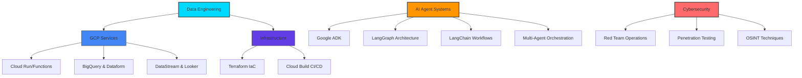

# 🚀 @juand-gv - Data Engineer & Security Enthusiast

<div align="center">
  
[](https://git.io/typing-svg)

</div>

---

## 🎯 About Me

```python
class DataEngineer:
    def __init__(self):
        self.name = "@juand-gv"
        self.role = "Data Engineer"
        self.location = "Colombia 🇨🇴"
        self.current_focus = ["GCP", "IaC", "DataOps", "AI Agent Systems"]
        self.learning = ["CyberSecurity", "Red Team Operations"]
        self.passion = "Transforming data into insights, securing digital landscapes and playing CTFs"
    
    def get_skills(self):
        return {
            "cloud": ["Google Cloud Platform", "Cloud Run", "Cloud Functions", "App Engine"],
            "data": ["BigQuery", "Dataform", "DataStream", "Looker", "Apache Beam"],
            "ai_agents": ["Google ADK", "LangGraph", "LangChain", "Agent Systems"],
            "languages": ["Python", "SQL", "Bash"],
            "iac": ["Terraform", "Cloud Deployment Manager"],
            "cicd": ["Cloud Build", "GitHub Actions", "Jenkins"],
            "security": ["Penetration Testing", "OSINT", "GEOINT", "Network Security"],
            "devops": ["Docker", "Kubernetes", "GitOps", "Monitoring"]
        }
```

## 🛠️ Tech Stack

<div align="center">

### ☁️ Google Cloud Platform


### 🤖 AI Agent Development


### 📊 Data Engineering & Analytics


### 🏗️ Infrastructure as Code


### 🚀 CI/CD & DevOps


### 💻 Languages & Core Tools


### 🛡️ Security & Red Team


</div>

## 📈 GitHub Analytics

<div align="center">
  
  
</div>

<div align="center">
  
</div>

## 🎯 Current Focus



## 🌱 Learning Journey

- 🔴 **Red Team Operations** - Ethical hacking and penetration testing
- 🛡️ **Advanced Cybersecurity** - Network security and vulnerability assessment
- 🤖 **Advanced AI Agents** - Multi-agent systems and complex orchestration workflows
- 🧠 **LangGraph Patterns** - Building sophisticated agent architectures
- ☁️ **Advanced GCP** - Professional Cloud Architect certification path

### TryHackMe


## 📫 Let's Connect!


<div align="center">

[](https://www.linkedin.com/in/jdgallegov/)
[](mailto:jgallegovillada@gmail.com)

</div>

---

<div align="center">
  
  
  **✨ "Data is the new oil, agents are the new engineers, security is the foundation" ✨**
</div>
